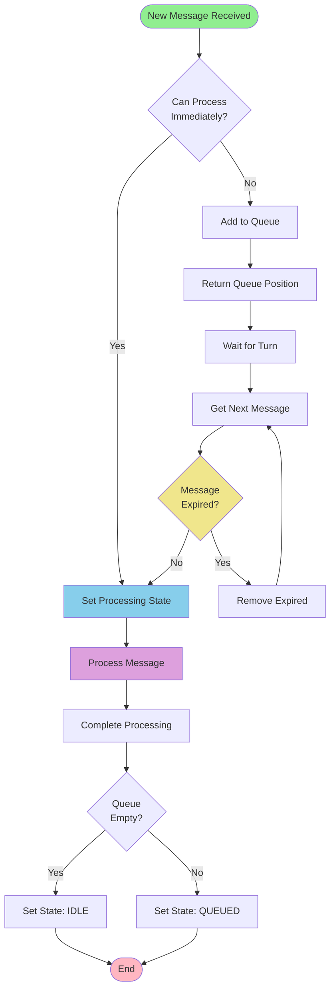
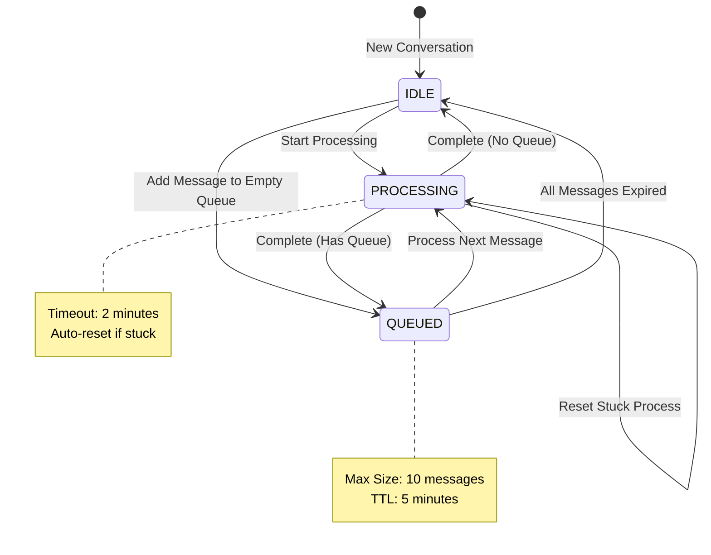
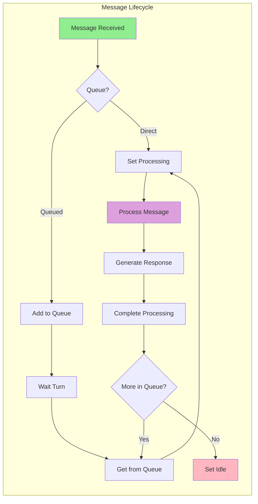
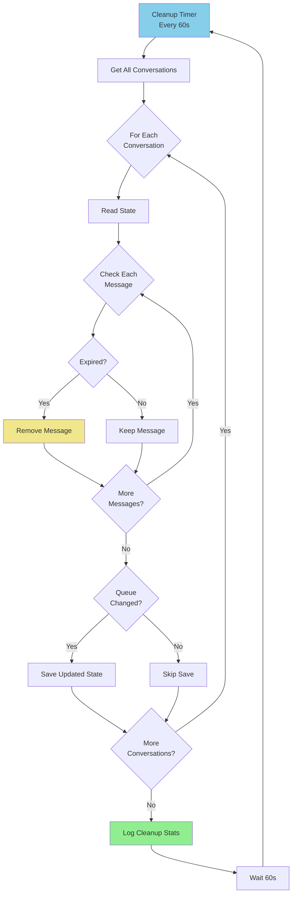
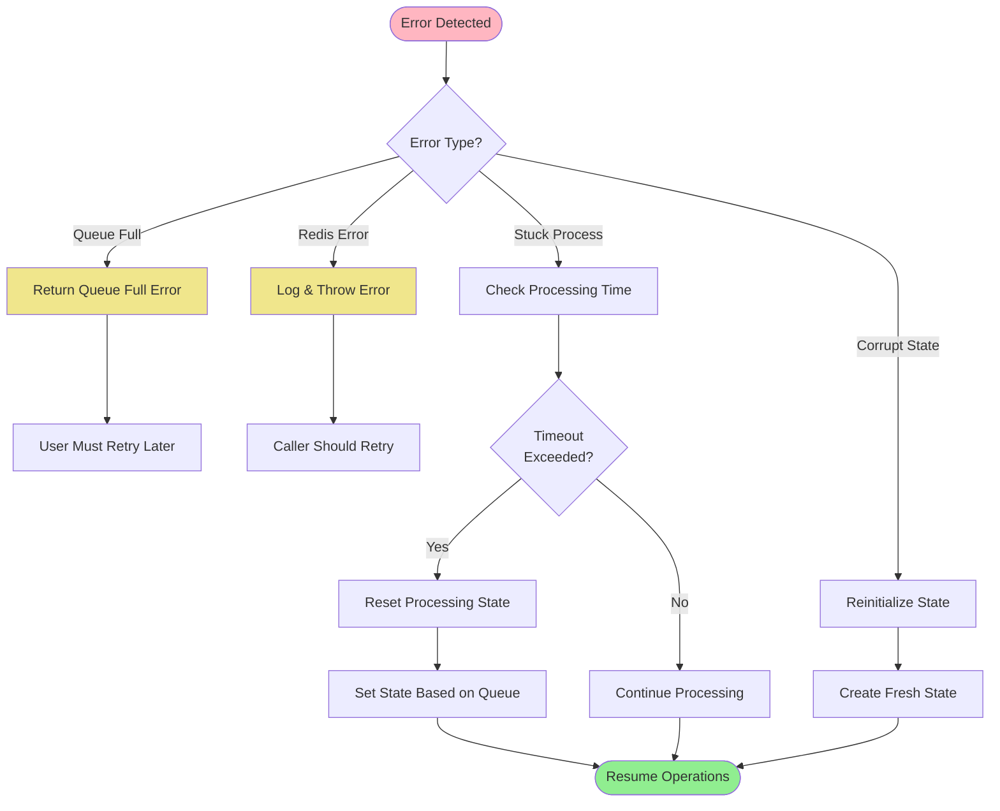
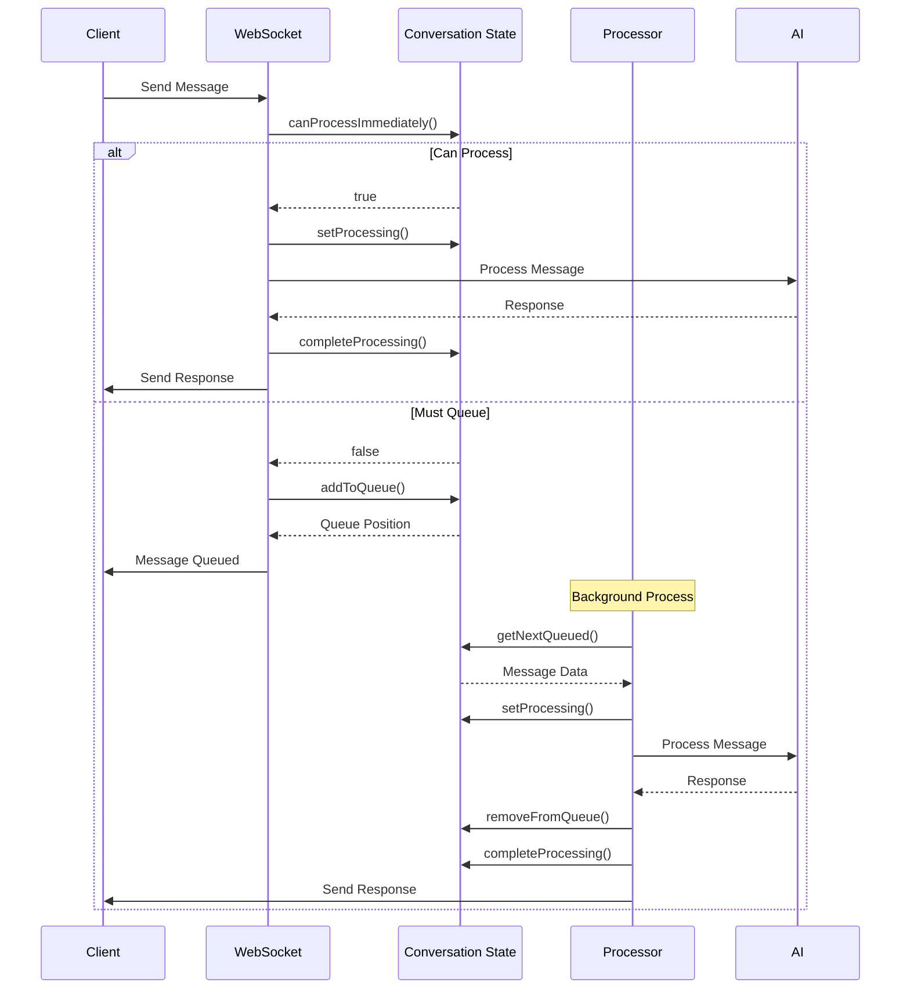
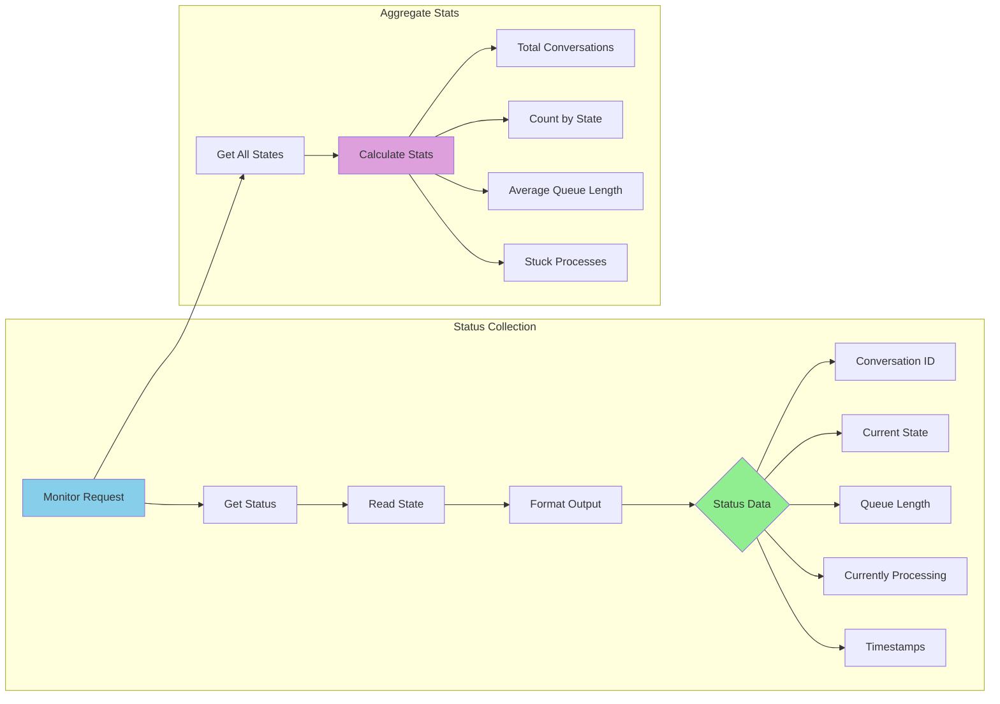
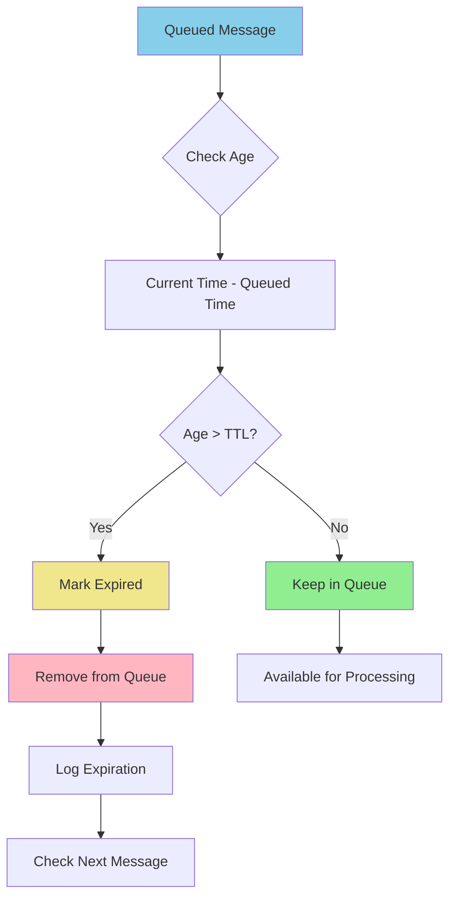
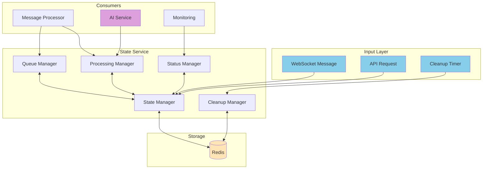

# Conversation State Service Flow Diagrams

## Message Queue Flow

## State Transition Diagram

## Processing Lifecycle

## Cleanup Process Flow

## Error Recovery Flow

## WebSocket Integration Flow

## Queue Status Monitoring

## Message Expiration Flow

## Complete System Flow

