# Chat Store Flow Diagrams

## Message Lifecycle Flow

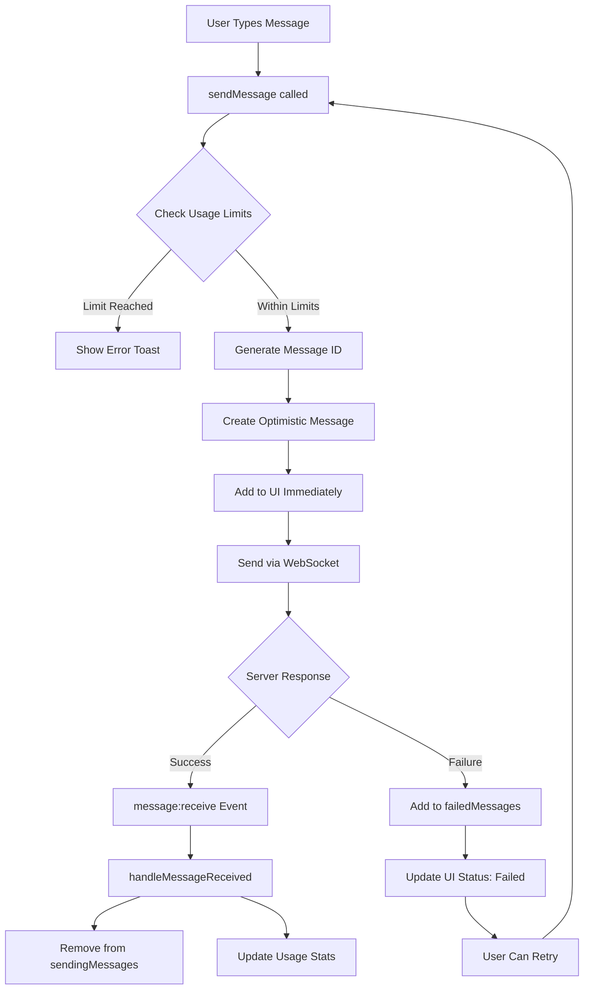

## AI Response Flow

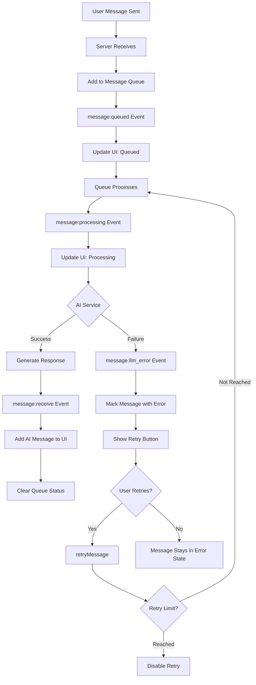

## Connection State Flow

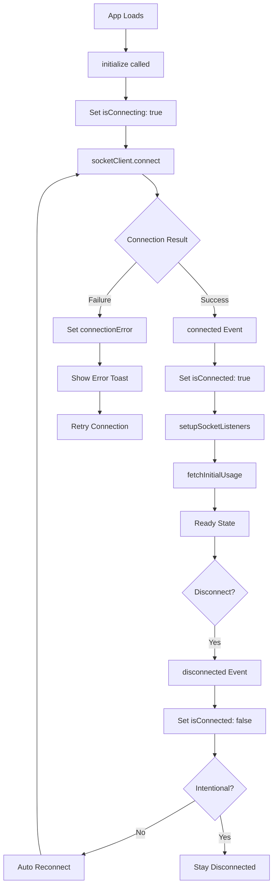

## Message Like Flow

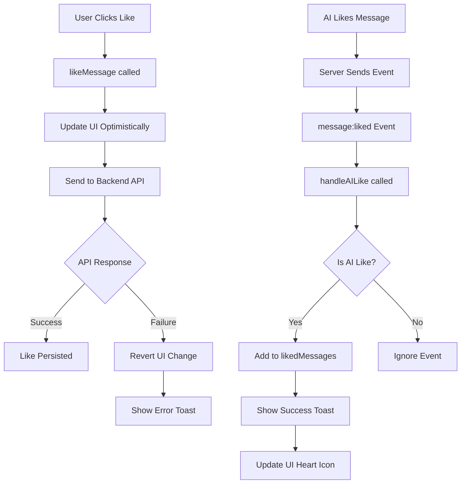

## Conversation Management Flow

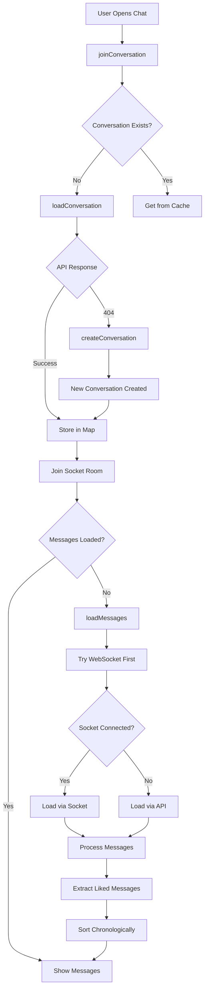

## Queue Status Flow

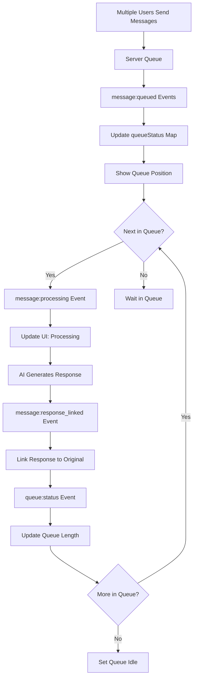

## Error Handling Flow

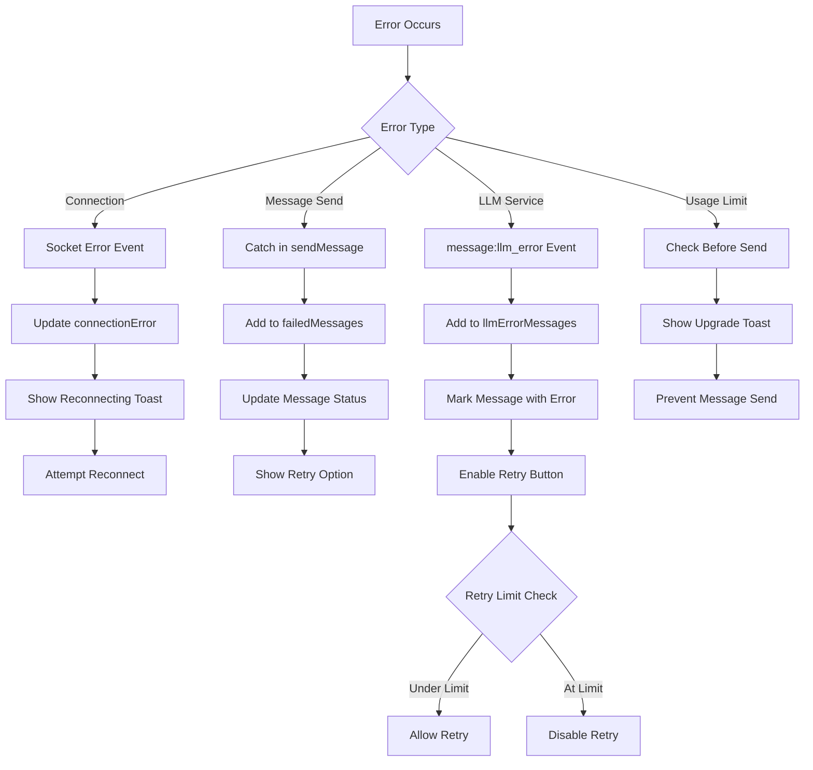

## State Synchronization Flow

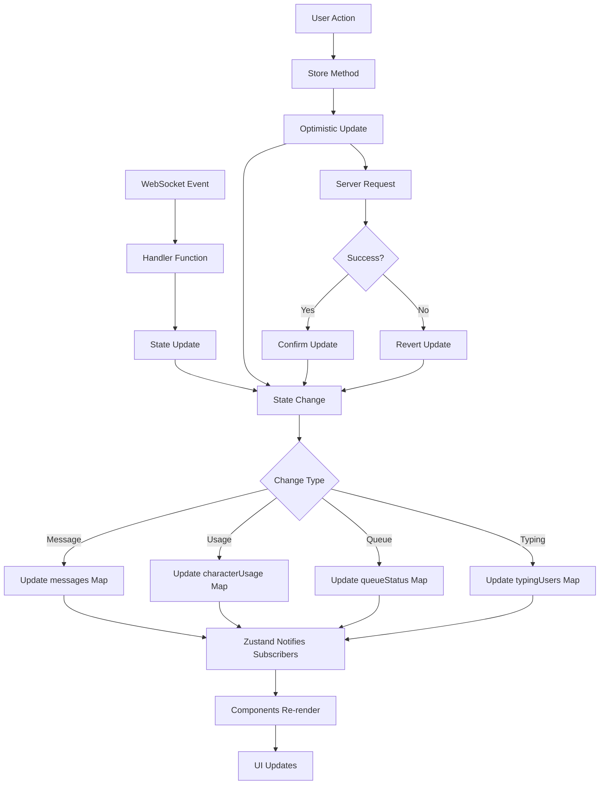

## Usage Tracking Flow

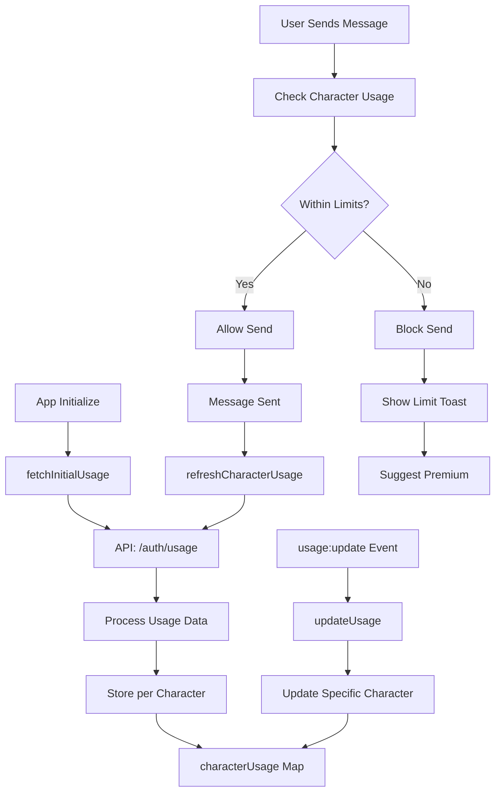

## Component Integration Flow

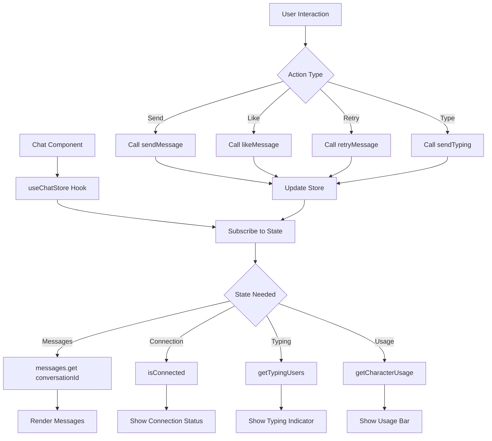

## Cleanup Flow

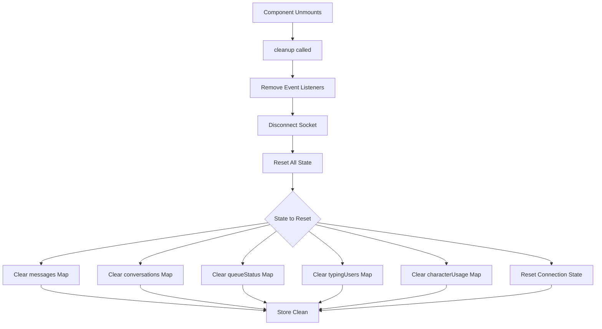

## Notes

- **Optimistic Updates**: Most user actions update UI immediately for better UX
- **Error Recovery**: All errors have recovery mechanisms (retry, reconnect)
- **State Consistency**: WebSocket events and API responses keep state in sync
- **Performance**: Maps used for O(1) lookups, selective subscriptions prevent unnecessary renders
- **Queue System**: Ensures messages are processed in order, prevents AI response mixing